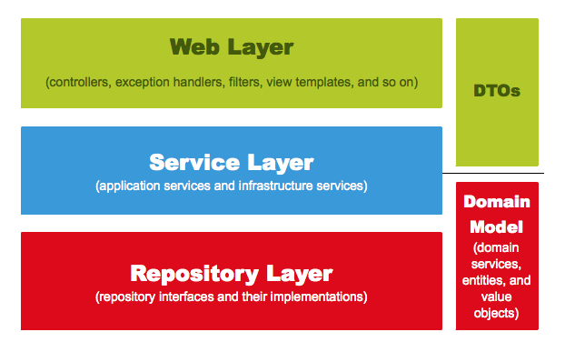
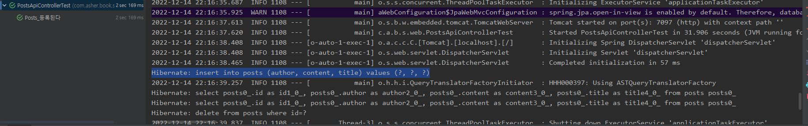
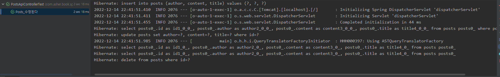
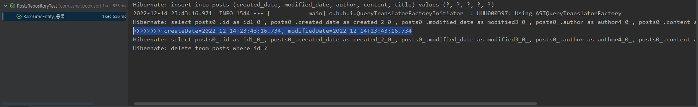

해당 REPO는 [스프링 부트와 AWS로 혼자 구현하는 웹 서비스](http://www.yes24.com/Product/Goods/83849117) 교재를 바탕으로 공부하였습니다.

## 환경
- Java 8
- Gradle 4.x
- Spring Boot 2.1.x

# TDD 
테스트가 주도하는 개발
- 항상 실패하는 테스트를 먼저 작성 (Red)
- 테스트가 통과하는 프로덕션 코드 작성 (Green)
- 테스트가 통과하면 프로덕션 코드를 리팩토링 (Refactor)

## 단위테스트 이점
- 단위테스트틑 개발 단계 초기에 문제발견
- 리팩토링, 라이브러리 업그레이드 시 기존 기능이 올바르게 작동하는지 확인
- 기능에 대한 불확실성 감소
- 시스템에 대한 실제 문서 제공

## 왜 테스트 코드를 작성해야 하는가?
단위테스트를 배우기 전 개발방식
1. 코드작성
2. 프로그램 실행
3. API테스트 도구로 HTTP요청
4. 요청결과를 sout으로 확인
5. 결과가 다르면 tomcat을 중지하고 코드 수정

매번 2-5 과정이 반복되고 의미없는 시간 소요됨<br>
또한 사람의 눈으로 검증하지 않고 자동검증을 할 필요가 있음<br>
기존 기능이 잘 작동되는 것을 보장하게 해준다.
-> 자바의 테스트 프레임워크 => JUnit (해당 교재에서는 JUnit4사용)

# 2. Gradle -> Spring-boot

## Application

```java
package com.asher.book.springboot;

import org.springframework.boot.SpringApplication;
import org.springframework.boot.autoconfigure.SpringBootApplication;

@SpringBootApplication
public class Application {
    public static void main(String[] args) {
        SpringApplication.run(Application.class, args);
    }
}
```
프로젝트의 메인 클래스
- @SpringBootApplication으로 인해 스플이 부트 자동 설정, 스프링 Bean 읽기와 생성을 모두 자동으로 설정
- @SpringBootApplication이 있는 위치부터 설정을 읽어가기 때문에 이 클래스는 항상 프로젝트 최상단에 위치해야함.
- SpringApplication.run으로 인해 내장 WAS를 실행하며, 항상 서버에 톰켓을 설치할 필요가없음
- 내장 WAS사용을 권장하는데, **언제 어디서나 같은 환경에서 스프링 부트를 배포** 할수 있기 때문

## controller
```java
package com.asher.book.springboot.web;

import org.springframework.web.bind.annotation.GetMapping;
import org.springframework.web.bind.annotation.RestController;

@RestController // 1
public class HelloController {

    @GetMapping("/hello") // 2
    public String hello(){
        return "hello";
    }
}
```

### (1) RestController
- 컨트롤러를 JSON으로 반환하는 컨트롤러로 만듦
- @ResponseBody를 각 메서드 마다 선언했던 것을 한번에 선언하는 것과 같음

### (2) GetMapping
- HTTP Method인 Get의 요청을 받을 수 있는 API를 만들어 줌

## HelloControllerTest

```java
package com.asher.book.springboot.web;

import org.junit.Test;
import org.junit.runner.RunWith;
import org.springframework.beans.factory.annotation.Autowired;
import org.springframework.boot.test.autoconfigure.web.servlet.WebMvcTest;
import org.springframework.test.context.junit4.SpringRunner;
import org.springframework.test.web.servlet.MockMvc;

import static org.junit.Assert.*;
import static org.springframework.test.web.servlet.request.MockMvcRequestBuilders.get;
import static org.springframework.test.web.servlet.result.MockMvcResultMatchers.content;
import static org.springframework.test.web.servlet.result.MockMvcResultMatchers.status;

@RunWith(SpringRunner.class) // 1
@WebMvcTest(controllers = HelloController.class) // 2
public class HelloControllerTest { 

    @Autowired // 3
    private MockMvc mvc; // 4

    @Test
    public void hello가_리턴된다() throws Exception{
        String hello = "hello";

        mvc.perform(get("/hello")) // 5
                .andExpect(status().isOk()) // 6
                .andExpect(content().string(hello)); //7
    }
}
```

### (1) RunWith(SpringRunner.class)
- 테스트를 진행할 때 JUnit에 내장된 실행자 외에 다른 실행자를 실행.
- 여기서는 SpringRunner라는 스프링 실행자를 사용
- 즉, 스플이 부트 테스트와 JUnit사이에 연결자 역할

### (2) WebMvcTest
- 여러 스프링 테스트 어노테이션 중, WEB(spring mvc)에 집중할 수 있는 어노테이션
- 선언할 경우 @Controller, @ControllerAdvice등을 사용할 수 있음
- 단, @Service, @Component, @Repository등은 사용할 수 없음
- 여기서는 컨트롤러만 사용하기 때문에 선언함

### (3) Autowired
- 스프링이 관리하는 빈을 주입받음

### (4) private MockMvc mvc
- 웹 API를 테스트할 때 사용
- 스프링 MVC테스트의 시작점
- 이 클래스를 통해 HTTP, GET, POST등에 대한 API 테스트를 할 수 있다.

### (5) MVC.perform(get("/hello"))
- MockMvc를 통해 /hello주소로 HTTP GET 요청을 한다.
- 체이닝이 지원되어 아래와 같이 여러 검증 기능을 선언할 수 있다.

### (6) .andExpect(status().isOk())
- mvc.perform의 결과를 검증
- HTTP Header의 Status를 검증
- 흔히 알고 있는 200, 404, 500 등의 상태 검증
- 여기서는 200인지 아닌지 검증

### (7) .andExpect(content().string(hello))
- mvc.perform의 결과를 검증한다.
- 응답 본문의 내용을 검증한다.
- Controller에서 "hello"를 리턴하기 때문에 이 값이 맞는지 검증한다.

## 롬복
Project setting -> Build, Execution -> compiler -> annotation Processor -> Check! Enable annotation proecess

### HelloResponseDto

```java
package com.asher.book.springboot.web.dto;

import lombok.Getter;
import lombok.RequiredArgsConstructor;

@Getter // 1
@RequiredArgsConstructor // 2
public class HelloResponseDto {
    private final String name;
    private final int amount;
}
```

### (1) @Getter
- 선언된 모든 필드의 get메서드를 생성

### (2) @RequiredArgsConstructor
- 선언된 모든 final 필드가 포함된 생성자를 생성해 줍니다.
- final이 없는 필드는 생성자에 포함되지 않습니다.

### HelloResponseDto test-code
```java
package com.asher.book.springboot.web.dto;

import org.junit.Test;

import static org.assertj.core.api.Assertions.assertThat;

public class HelloResponseDtoTest {

    @Test
    public void 롬복_기능_테스트(){
        //given
        String name = "test";
        int amount = 1000;

        //when
        HelloResponseDto dto = new HelloResponseDto(name, amount);

        //then
        assertThat(dto.getName()).isEqualTo(name); // 1, 2
        assertThat(dto.getAmount()).isEqualTo(amount);
    }
}
```
### (1) assertThat
- assertj라는 테스트 검증 라이브러리의 검증 메서드 입니다.
- 검증하고 싶은 대상을 메서드 인자로 받습니다.
- 메서드 체이닝이 지원되어 isEqualTo와 같이 메서드를 이어서 사용할 수 있습니다. 

### (2) isEqualTo
- assertj의 동등 비교 메서드 입니다.
- assertThat에 있는 값과 isEqualTo의 값을 비교해서 같을 때만 성공입니다. 

```java
@GetMapping("/hello/dto")
public HelloResponseDto helloDto(@RequestParam("name") String name, @RequestParam("amount") int amount) { // 1
    return new HelloResponseDto(name, amount);
}
```
### (1) RequestParam
- 외부에서 API로 넘긴 파라미터를 가져오는 어노테이션
- 여기서는 외부에서 name(@RequestParam("name"))이란 이름으로 넘긴 파라미터를 메소드 파라미터 name(String name)에 저장하게 된다.

```java
@Test
public void helloDto가_리턴된다() throws Exception {
    String name = "hello";
    int amount = 1000;

    mvc.perform(
            get("/hello/dto")
                    .param("name", name) // 1
                    .param("amount", String.valueOf(amount)))
                    .andExpect(status().isOk())
                    .andExpect(jsonPath("$.name", is(name))) //2
                    .andExpect(jsonPath("$.amount", is(amount)));
}
```
### (1) param
- API테스트할 때 사용될 요청 파라미터를 설정
- 단, 값은 String만 허용
- 그래서 숫자/날짜 등의 데이터도 등록할 때는 문자열로 변경해야만 가능

### (2) jsonPath
- JSON응답값을 필드별로 검증할 수 잇는 메서드
- $를 기준으로 필드명을 명시
- 여기서는 name과 amount를 검증하니 $.name, $.amount로 검증

# 3. Spring-boot + JPA

## JPA?
-> 지향하는 바가 다른 2개영역(객체지향 프로그래밍 언어와 관계형 데이터베이스)을 
중간에서 패러다임 일치를 시켜주기 위한 기술

## 프로젝트에 SPring Data Jpa적용

```
// 1
implementation('org.springframework.boot:spring-boot-starter-data-jpa')
// 2 
implementation('com.h2database:h2')
```

### (1) spring-boot-starter-data-jpa
- 스프링 부트용 Spring Data jpa 추상화 라이브러리
- 스프링 부트 버전에 맞춰 자동으로 JPA관련 라이브러리들의 버전을 관리

### (2) h2
- 인메모리 관계형 데이터베이스
- 별도의 설치가 필요 없이 프로젝트 의존성만으로 관리할 수 있음
- 메모리에서 실행되기 때문에 애플리케이션을 재시작 할 때마다 초기화 된다는 점을 이용하여 테스트용도로 많이 사용

```java
package com.asher.book.springboot.domain.posts;

import lombok.Builder;
import lombok.Getter;
import lombok.NoArgsConstructor;

import javax.persistence.*;

@Getter // 6
@NoArgsConstructor // 5
@Entity // 1
public class Posts {
    @Id // 2
    @GeneratedValue(strategy = GenerationType.IDENTITY) // 3
    private Long id;

    @Column(length = 500, nullable = false) // 4
    private String title;

    @Column(columnDefinition = "TEXT", nullable = false)
    private String content;

    private String author;

    @Builder // 7
    public Posts(String title, String content, String author){
        this.title = title;
        this.content = content;
        this.author = author;
    }
}
```

- 저자는 어노테이션 순서를 주요 어노테이션 클래스에 가깝게 둔다
- @Entity는 JPA의 어노테이션 이며, @Getter와 @NoArgsConstructor는 롬복의 어노테이션임
- 롬복은 코드를 단순화 시켜주지만 필수 어노테이션이 아니므로 주오 어노테이션인 @Entity를 클래스에 가깝게 두고 롬복 어노테이션을 그 위에 선언함
- 이렇게 하면 새 언어로 전환할 때 필요없는 어노테이션인 경우 쉽게 삭제가 가능하다. 
- **여기서 Posts클래스는 실제 DB의 테이블과 매칭될 클래스이며 보통 Entity클래스 라고 한다.**
- JPA를 사용하면 DB데이터에 작업할 경우 실제 쿼리를 날리는 것 보다, Entity클래스의 수정을 통해 작업함.


### (1) @Entity
- 테이블과 링크될 클래스를 나타냄
- 기본값으로 클래스의 카멜케이스 이름을 언더스코어 네이밍으로 테이블 이름을 매칭
- Ex) SalesManager.java -> sales_manager table

### (2) @Id
- 해당 테이블의 PK필드를 나타냅니다.

### (3) @GeneratedValue
- PK의 생성 규칙을 나타냄
- 스프링 부트 2.0에서는 GenerationType.IDENTITY옵션을 추가해야만 auto_increment가 된다

### (4) @Column
- 테이블의 칼럼을 나타내며 선언하지 않더라도 해당 클래스의 필드는 모두 컬럼이 된다.
- 사용하는 이유는, 기본값 외에 추가로 변경이 필요한 옵션이 있으면 사용함
- 문자열 경우 VARCHAR(255)가 기본값, 사이즈를 500으로 늘리고 싶거나(ex.title), 타입을 TEXT로 변경하고 싶거나 (ex:content)등의 경우에 사용함.

### (5) @NoArgsConstructor
- 기본 생성자 자동 추가
- public Posts() {}와 같은 효과

### (6) @Getter
- 클래스 내 모든 필드의 Getter메서드를 자동생성

### (7) @Builder
- 해당 클래스의 빌더 패턴 클래스를 생성
- 생성자 상단에 선언시 생성자에 포함된 필드만 빌더에 포함

### Tip
- Entity의 PK는 Long타입의 Auto_increment를 추천함 (Mysql기준 bigint 타입이 됨)
- 주민등록번호와 같이 비즈니스상 유니크 키나, 여러 키를 조합한 복합키로 PK를 잡을 경우 난감한 상황이 발생됨
1. FK를 맺을 때 다른 테이블에서 복합키 전부를 갖고 있거나, 중간 테이블을 하나 더 둬야 하는 상황 발생
2. 인덱스에 좋은 영향을 끼치지 못함
3. 유니크한 조건이 변경될 경우 PK 전체를 수정해야 하는 일이 발생함.
4. 주민번호, 복합키 등은 유니크 키로 별도로 추가하는 것이 좋음.

<br/>

- Posts클래스에 특이점이 있는데 setter메서드가 없다.
- 자바빈 규약을 생각하면서 getter/setter를 무작정 생성하는 경우가 있는데 이렇게 되면 해당 클래스의 인스턴스 값들이 언제 어디서 변해야 하는지 코드상으로 명확히 구분할 수 없어, 차후 변경시 복잡해진다.
- 그래서 Entity클래스에서는 절대 setter메서드를 만들지 않는다. 
- 대신, 해당 필드의 값 변경이 필요하면 명확히 그 목적과 의도를 나타낼 수 있는 메서드를 추가해야한다. 

- 예를들어 주문 취소 메서드를 만든다고 가정하고 예시를 살펴보자.

잘못된 사용 예시
```java
public class Order{
    public void setStatus(boolean status){
        this.status = status;
    }
}

public void 주문서비스의_취소이벤트 () {
    order.setStatus(false);
}
```
올바른 사용 예시
```java
public class Order{
    public void cancelOrder(){
        this.status = false;
    }
}

public void 주문서비스의_취소이벤트 () {
    order.cancelOrder();
}
```
- setter가 없는 상황에서 값을 채워 DB에 삽입해야 하는 경우에는 일반적으로 생성자를 통해 최종값을 채운 후 DB에 삽입한다.
- 값 변경이 필요한 경우 해당 이벤트에 맞는 public 메서드를 호출하여 변경하는 것을 전제로 한다.
- 생성자 대신 Builder클래스를 이용하여 정의하는 것이 좋음
- **Posts 클래스 생성 이후 Posts 클래스로 DB에 접근하게 해줄 JpaRepository 인터페이스를 생성**

```java
import org.springframework.data.jpa.repository.JpaRepository;

public interface PostsRepository extends JpaRepository<Posts, Long> {
    
}
```
- 보통 MyBatis 등에서 Dao라고 불리는 DB Layer접근자 이다.
- **JPA에서는 Repository라고 부르며 인터페이스로 생성한다.**
- **단순히 인터페이스를 생성 후 JpaRepository<Entity 클래스, PK 타입>를 상속하면 기본적인 CRUD메서드가 자동으로 생성된다.**
- @Repository 어노테이션을 추가할 필요는 없다.
- **주의할 점은 Entitry클래스와 기본 Entity Repository는 함께 위치해야 한다**
- 둘은 밀접한 관계이므로 Entity클래스는 기본 Repository없이 제대로 역할을 할 수 없다.
- 나중에, 프로젝트 규모가 커져 도메인 별로 프로젝트를 분리한다면 Entity클래스와 기본 Repository 는 함께 움직여야 하므로 도메인 패키지에서 관리한다.

### 3.3 Spring Data JPA테스트코드 작성
```java
import org.junit.After;
import org.junit.Test;
import org.junit.runner.RunWith;
import org.springframework.beans.factory.annotation.Autowired;
import org.springframework.boot.test.context.SpringBootTest;
import org.springframework.test.context.junit4.SpringRunner;

import static org.assertj.core.api.Assertions.assertThat;

import java.util.List;

@RunWith(SpringRunner.class)
@SpringBootTest
public class PostsRepositoryTest {

    @Autowired
    PostsRepository postsRepository;

    @After // 1번
    public void cleanup(){
        postsRepository.deleteAll();
    }

    @Test
    public void 게시글저장_불러오기(){
        //given
        String title = "테스트 게시글";
        String content = "테스트 본문";

        postsRepository.save(Posts.builder() // 2번
                .title(title)
                .content(content)
                .author("asher")
                .build());

        // when
        List<Posts> postsList = postsRepository.findAll(); // 3번

        // then
        Posts posts = postsList.get(0);
        assertThat(posts.getTitle()).isEqualTo(title);
        assertThat(posts.getContent()).isEqualTo(content);
    }

}
```

### (1) @After
- Junit에서 단위 테스트가 끝날 때마다 수행되는 메소드를 지정
- 보통은 배포 전 전체 테스트를 수행할 때 테스트간 데이터 침범을 막기 위해 사용함
- 여러 테스트가 동시에 수행되면 테스트용 데이터베이스인 H2에 데이터가 그대로 남아 있어 다음 테스트 틸생 시 테스트가 실패할 수 있습니다.

### (2) postsRepository.save
- 테이블 posts에 insert/update 쿼리를 실행합니다.
- id값이 있다면 update가, 없다면 insert쿼리가 실행됩니다.

### (3) postsRepository.findAll
- 테이블 posts에 있는 모든 데이터를 조회해오는 메소드 입니다.

<br>
- 별다른 설정 없이 @SpringBootTest를 사용할 경우 H2데이터베이스를 자동으로 실행해 준다.
- 실제로 실행된 쿼리를 보려면 application.properties파일에 설정을 해 주어야한다. 

```
spring.jpa.show-sql=true
```

create 테이블에
```
Hibernate: create table posts (id bigint generated by default as identity, 
author varchar(255), content TEXT not null, title varchar(500) 
not null, primary key (id))
```
generated by default as identity 라는 옵션으로 생성되는덴 이는 H2의 쿼리 문법이 적용된 것.
출력 쿼리를 MySQL로 변경하려면 다음과 같이 설정

## 등록/수정/조회 API만들기
API를 만들기 위해 다음 클래스들이 필요
- Request를 데이터를 받을 Dto
- API요청을 받을 Controller
- 트랜잭션, 도메인 기능간의 순서를 보장하는 Service


- 여기서 본인도 그렇고 대부분의 살마들이 Service에서 비지니스 로직을 처리해야한다고 오해를 한다.
- 하지만 Service는 트랜잭션, 도메인 간 순서 보장의 역할만 한다. 


### 스프링의 웹 계층 

- Web Layer
  - 흔히 사용하는 컨트롤러와 뷰 템플릿 영역이다.
  - 이외에도 필터, 인터셉터, 컨트롤러 어드바이스 등 외부 요청과 응답 에 대한 전반적인 영역을 의미한다.
- Service Layer
  - @Service 에 사용되는 서비스 영역이다.
  - 일반적으로 Controller와 Dao의 중간 영역에서 사용된다.
  - @Transactional 이 사용되어야 하는 영역이기도 하다.
  - 서비스에서는 트랜잭션과 도메인 간의 순서만 보장한다.
- Repository Layer
  - Database 와 같이 데이터 저장소에 접근하는 영역이다.
  - Dao(Data Access Object) 영역이라고 생각하면 된다.
- DTOs
  - DTO(Data Transfer Object)는 계층 간에 데이터 교환을 위한 객체 를 의미, DTOs는 이들의 영역을 의미한다.
  - 예를 들어, 뷰 템플릿 엔진에서 사용될 객체나 Repository Layer에서 결과로 넘겨준 객체 등이 이들을 말한다.
- Domain Model
  - 도메인이라 불리는 개발 대상을 모든 사람들이 동일한 관점에서 이해할 수 있고 공유할 수 있도록 단순화시킨 것을 도메인 모델이라 한다.
  - 비즈니스 로직을 처리하는 영역이다.
  - 이를테면 택시 앱이라 하면 배차, 탑승, 요금 등이 모두 도메인이 될 수 있다.
  - @Entity 가 사용된 영역 역시 도메인 모델이라고 이해하면 된다.
  - 다만, 무조건 데이터베이스의 테이블과 관계가 있어야 하는 것은 아니다.
  - VO처럼 값 객체들도 이 영역에 해당한다.

### 왜 비즈니스 로직을 도메인 계층에 작성하는가
- Service Layer는 다양한 Model(Domain)을 읽어 제공한다. 복잡한 서비스는 더 많은 Model을 읽어 서비스를 제공하기 때문에 Service 로직의 복잡도가 매우 높아진다.
- 이런 로직의 복잡도를 낮추기 위해 최대한 비즈니스 로직을 Model(Domain)쪽으로 이동시킨다.
- 복잡도를 낮춤으로써 유지보수와 테스트하기 쉬운 코드가 생기고 결국엔 유연한 Software를 얻을 수 있다.

### Service Layer 작성 시 주의사항
- Service는 다른 Service를 조합하거나 DAO를 연결하는 역할을 수행.
- Service는 가볍게, Service에 핵심 비즈니스 로직을 구현하기 보다는 로직의 상태값을 가지고 있는 모델이 담당해야 한다.
- Service에서 Service를 참조 가능하나 계층 구조가 명확해야한다. (순환참조를 방지하기 위해서)

#### 기존 서비스로 처리하던 방식(트랜잭션 스크립트)
```java
@Transactional
public Order cancelOrer(int orderId) {
        OrdersDto order = orderDao.selectOrders(orderId);
        BillingDto billing = billingDao.selectBilling(orderId);
        DeliveryDto delivery= deliveryDao.selectDelivery(orderId);

        String deliveryStatus = delivery.getStatus();

        if("IN_PROGRESS".equals(deliveryStatus)) {
        delivery.setStatus("CANCEL");
        deliveryDao.update(delivery);
        }

        order.setStatus("CANCEL");
        ordersDao.update(order);

        billing.setStauts("CANCEL");
        deliveryDao.update(billing);

        return order;
        }
```
- 모든 로직이 서비스 클래스 내부에서 처리
- 서비스 계층이 무의미

#### 도메인 모델에서 처리할 경우
```java
@Transactional
public Order cancelOrer(int orderId) {
    Orders order = orderRepository.findById(orderId);
    Billing billing = billingRepository.findByOrderId(orderId);
    Delivery delivery= deliveryRepository.findByOrderId(orderId);

    delivery.cancel();
    order.cancel();
    billing.cancel();

    return order;
}
```
트랜잭션과 도메인 간 순서만 보장함.

- 스프링에서 Bean을 주입받는 방식은 Autowired, setter, 생성자 3가지 방식이 있다.
- 생성자로 주입받는방식을 권하며(@Autowired사용을 권장하지 않음) 생성자로 Bean객체를 받도록 하면 @Autowired와 동일한 효과를 볼 수 있다.
- @RequiredArgsConstructor가 final이 선언된 모든 필드를 인자값으로 하는 생성자를 롬복의 @RequiredArgsConstructor가 대신 생성해 준다.
- 생성자를 안쓰고 롬복 어노테이션을 사용한 이유는 해당 클래스의 의존성 관계가 변경될 때마다 생성자 코드를 계속해서 수정해야하는 번거로움이 있기 때문.

### 등록 API작성

```java
import com.asher.book.springboot.domain.posts.Posts;
import lombok.Builder;
import lombok.Getter;
import lombok.NoArgsConstructor;

@Getter
@NoArgsConstructor
public class PostsSaveRequestDto {
    private String title;
    private String content;
    private String author;

    @Builder
    public PostsSaveRequestDto(String title, String content, String author){
        this.title = title;
        this.content = content;
        this.author = author;
    }
    
    public Posts toEntity(){
        return Posts.builder()
                .title(title)
                .content(content)
                .author(author)
                .build();
    }
}
```

- 여기서 Entity클래스와 거의 유사한 형태임에도 Dto클래스를 추가로 생성함.
- 하지만, 절대로 Entity클래스를 Request/Response클래스로 사용해서는 안된다.
- Entity클래스는 DB와 맞닿은 핵심 클래스이며, Entity클래스를 기준으로 테이블이 생성되고, 스키마가 변경된다. 
- 화면 변경은 사소한 기능변경인데, 이를 위해 테이블과 연결된 Entity 클래스를 변경하는 것은 너무 큰 변경임
- 수많은 서비스 클래스나 비즈니스 로직들이 Entity 클래스를 기준으로 동작함
- Entity클래스가 변경되면 여러 클래스에 영향을 끼치지만, Request와 Response용 Dto는 View를 위한 클래스라 정말 자주 변경이 필요함
- 그러므로 View Layer와 DB Layer의 역할 분리를 철저하게 하는 것이 좋다.

### PostsApiControllerTest 생성
```java
package com.asher.book.springboot.web;

import com.asher.book.springboot.domain.posts.Posts;
import com.asher.book.springboot.domain.posts.PostsRepository;
import com.asher.book.springboot.web.dto.PostsSaveRequestDto;
import org.junit.After;
import org.junit.Test;
import org.junit.runner.RunWith;
import org.springframework.beans.factory.annotation.Autowired;
import org.springframework.boot.test.context.SpringBootTest;
import org.springframework.boot.test.web.client.TestRestTemplate;
import org.springframework.boot.web.server.LocalServerPort;
import org.springframework.http.HttpStatus;
import org.springframework.http.ResponseEntity;
import org.springframework.test.context.junit4.SpringRunner;

import java.util.List;

import static org.assertj.core.api.Assertions.assertThat;

@RunWith(SpringRunner.class)
@SpringBootTest(webEnvironment = SpringBootTest.WebEnvironment.RANDOM_PORT)
public class PostsApiControllerTest {
    @LocalServerPort
    private int port;

    @Autowired
    private TestRestTemplate restTemplate;

    @Autowired
    private PostsRepository postsRepository;

    @After
    public void tearDown() throws Exception {
        postsRepository.deleteAll();
    }

    @Test
    public void Posts_등록() throws Exception {
        //given
        String title = "title";
        String content = "content";
        String url = "http://localhost:" + port + "/api/v1/posts";
        PostsSaveRequestDto requestDto = PostsSaveRequestDto.builder()
                .title(title)
                .content(content)
                .author("author")
                .build();

        //when
        ResponseEntity<Long> responseEntity = restTemplate.postForEntity(url,requestDto,Long.class);

        //then
        assertThat(responseEntity.getStatusCode()).isEqualTo(HttpStatus.OK);
        assertThat(responseEntity.getBody()).isGreaterThan(0L);

        List<Posts> all = postsRepository.findAll();
        assertThat(all.get(0).getTitle()).isEqualTo(title);
        assertThat(all.get(0).getContent()).isEqualTo(content);

    }
}
```
- Api Controller를 테스트할 때에는 HelloController와 달리 @WebMvcTest를 사용하지 않습니다.
- @WebMvcTest의 경우, JPA 기능이 작동하지 않기 때문에 해당 어노테이션을 사용하지 않음.
- JPA 기능까지 한번에 테스트할 때에는 @SpringBootTest와 TestRestTemplate을 사용하면 된다.
- WebEnvironment.RANDOM_PORT로 인해 랜덤 포트 실행된 것을 해당 테스트 코드 실행 시 확인할 수 있다.

### 등록 API테스트


### 수정/조회 API작성
update, findById 추가
```java
package com.asher.book.springboot.web;

import com.asher.book.springboot.service.posts.PostsService;
import com.asher.book.springboot.web.dto.PostsResponseDto;
import com.asher.book.springboot.web.dto.PostsSaveRequestDto;
import lombok.RequiredArgsConstructor;
import org.springframework.web.bind.annotation.*;

@RequiredArgsConstructor
@RestController
public class PostsApiController {
    private final PostsService postsService;

    @PostMapping("api/v1/posts")
    public Long save(@RequestBody PostsSaveRequestDto requestDto) {
        return postsService.save(requestDto);
    }

    @PutMapping("/api/v1/posts/{id}")
    public Long update(@PathVariable Long id, @RequestBody PostsUpdateRequestDto requestDto) {
        return postsService.update(id, requestDto);
    }

    @GetMapping("/api/v1/posts/{id}")
    public PostsResponseDto findById(@PathVariable Long id) {
        return postsService.findById(id);
    }
}
```

```java
package com.asher.book.springboot.web.dto;

import com.asher.book.springboot.domain.posts.Posts;
import lombok.Getter;

@Getter
public class PostsResponseDto {

    private Long id;
    private String title;
    private String content;
    private String author;

    public PostsResponseDto(Posts entity) {
        this.id = entity.getId();
        this.title = entity.getTitle();
        this.content = entity.getContent();
        this.author = entity.getAuthor();
    }
}
```
- PostsResponseDto는 Entity의 필드 중 일부만 사용하므로, 생성자로 Entity를 받아 필드에 값을 넣는다.
- 굳이 모든 필드를 가진 생성자가 필요하지 않아 DTO는 Entity를 받아 처리한다.

```java
package com.asher.book.springboot.web.dto;

import lombok.Builder;
import lombok.Getter;
import lombok.NoArgsConstructor;

@Getter
@NoArgsConstructor
public class PostsUpdateRequestDto {

    private String title;
    private String content;

    @Builder
    public PostsUpdateRequestDto(String title, String content) {
        this.title = title;
        this.content = content;
    }
}
```

update 추가
```java
public class Posts {
...
    public void update(String title, String content) {
        this.title = title;
        this.content= content;
    }
}
```

#### PostService 기존코드 추가
```java
@RequiredArgsConstructor
@Service
public class PostsService {
...
    @Transactional
    public Long update(Long id, PostsUpdateRequestDto requestDto) {
        Posts posts = postsRepository.findById(id)
                .orElseThrow(() -> new IllegalArgumentException("해당 게시글이 없습니다. id="+ id));
        posts.update(requestDto.getTitle(), requestDto.getContent());

        return id;
    }

    public PostsResponseDto findById(Long id) {
        Posts entity = postsRepository.findById(id)
                .orElseThrow(() -> new IllegalArgumentException("해당 게시글이 없습니다. id="+ id));

        return new PostsResponseDto(entity);
    }
}
```
- update 기능을 보면, 데이터베이스에 쿼리를 날리는 부분이 없습니다. 이것은 JPA의 영속성 컨텍스트 때문.
- 영속성 컨텍스트란, entity를 영구 저장하는 환경입니다. 일종의 논리적 개념이라고 볼 수 있으며, JPA의 핵심 내용은 엔티티가 영속성 컨텍스트에 포함되어 있냐 아니냐로 갈린다.
- JPA의 EntityManager가 활성화된 상태로(Spring Data JPA 기본 옵션) 트랜잭션 안에서 데이터베이스에서 데이터를 가져오면 이 데이터는 영속성 컨텍스트가 유지되는 상태이다.
- 이 상태에서 해당 데이터 값을 변경하면, 트랜잭션이 끝나는 시점에 해당 테이블에 변경분을 반영한다. 
- 즉, Entity 객체의 값만 변경하면 별도로 Update 쿼리를 날릴 필요가 없다.
- 이 개념을 *더티 체킹(dirty checking)*이라고 한다.

수정 기능의 코드를 검증하기 위해 test 패키지 중 web 패키지에 PostsApiControllerTest 내에 아래와 같이 코드를 추가
```java
@RunWith(SpringRunner.class)
@SpringBootTest(webEnvironment = SpringBootTest.WebEnvironment.RANDOM_PORT)
public class PostsApiControllerTest {

...

    @Test
    public void Posts_수정된다() throws Exception {
        // given
        Posts savedPosts = postsRepository.save(Posts.builder()
            .title("title")
            .content("content")
            .author("author")
            .build());

        Long updateId = savedPosts.getId();
        String expectedTitle = "title2";
        String expectedContent = "content2";

        PostsUpdateRequestDto requestDto = PostsUpdateRequestDto.builder()
                .title(expectedTitle)
                .content(expectedContent)
                .build();

        String url = "http://localhost:" + port + "/api/v1/posts/" + updateId;

        HttpEntity<PostsUpdateRequestDto> requestEntity = new HttpEntity<>(requestDto);

        // when
        ResponseEntity<Long> responseEntity = restTemplate.
                exchange(url, HttpMethod.PUT, requestEntity, Long.class);

        // then
        assertThat(responseEntity.getStatusCode()).isEqualTo(HttpStatus.OK);
        assertThat(responseEntity.getBody()).isGreaterThan(0L);
        List<Posts> all = postsRepository.findAll();
        assertThat(all.get(0).getTitle()).isEqualTo(expectedTitle);
        assertThat(all.get(0).getContent()).isEqualTo(expectedContent);
    }
}
```

- 테스트 결과를 보면, update 쿼리가 수정되는 것을 확인할 수 있다.
- 등록 API와 수정 API는 JPA와 테스트 코드를 이용해 확인해보았으니 조회 기능은 실제로 톰캣을 실행해서 확인해보자.
- 로컬 환경에서는 데이터베이스로 H2를 사용한다. 메모리에서 실행하기 때문에, 직접 접근하려면 웹 콘솔을 사용해야 한다. 먼저, 웹 콘솔 옵션을 활성화하기 위해 application.properties에 아래 내용을 추가.
```java
spring.h2.console.enabled=true
```

- 위 옵션을 추가한 후 Application 클래스의 main 메소드를 실행
- 실행 시 로그를 보면 8080 포트로 톰캣이 실행되었음을 확인할 수 있다. 
- 이때, http://localhost:8080/h2-console로 접속하면 다음과 같은 웹 콘솔 화면을 확인할 수 있다.


- h2-console 화면에서 JDBC URL이 jdbc:h2:mem:testdb로 뜨지 않는다면, 해당 내용을 기입한 후 Connect을 클릭.
- POSTS테이블이 나오면 정상.
- select * from posts;
- 이후 insert쿼리문입력
```sql
insert into posts (author, content, title) values ('author', 'content', 'title');
```

- 조회 API 결과 확인하기 위해 브라우저에서 http://localhost:8080/api/v1/posts/1을 입력해 조회 기능을 테스트하면 json 형식으로 확인이 가능함.
```json
{
"id": 1,
"title": "title",
"content": "content",
"author": "author"
}
```
- 기본적인 등록/수정/조회 기능을 모두 만들고 테스트까지 완료함.
- 등록/수정은 테스트 코드로 보호해 주고 있으니 이후 변경 사항이 있어도 안전하게 변경할 수 있음.

## JPA Auditing으로 생성시간/수정시간 자동화하기
- 보통 Entity에는 해당 데이터의 생성시간과 수정시간을 포함한다. 
- 언제 만들어졌는지, 언제 수정되었는지 등은 추후 유지보수에 있어 중요한 정보임 
- 따라서, 매번 DB에 삽입(insert) 또는 갱신(update) 전 날짜 데이터를 등록/수정하는 코드가 반드시 필요하게 된다.

```java
// 생성일 추가 코드 예
public void savePosts() {
...
posts.setCreateDate(new LocalDate());
postsRepository.save(post);
...
}
```
- 이런 단순하고 반복적인 코드가 모든 테이블과 서비스 메소드에 포함되면 코드가 지저분해질 수 있다. 
- 이를 해결하기 위해 JPA Auditing을 사용해보자.

Java8 부터 LocalDate와 LocalDateTime이 등장했다.<br> 
그간 Java의 기본 날짜 타입인 Date의 문제점을 제대로 고친 타입이라 Java8일 경우 무조건 써야한다.

#### Java Date의 문제점
- Java8이 나오기 전 Date와 Calendar 클래스는 다음과 같은 문제점이 있다.
- 불변(변경 가능한)객체가 아니다.
- 즉, 멀티스레드 환경에서 문제가 발생할 수 있다.
- Calendar는 월(month) 값 설계가 잘못되었다.
- 10월을 나타내는 Calendar.OCTOBER의 숫자 값은 '9'이다.
- 당연히 '10'으로 생각한 개발자는 크게 당황할 것이다.
- 이런 문제점을 피하기 위해 JodaTime이라는 오픈소스를 사용해서 문제점을 피했었고, Java8에선 LocalDate를 통해 해결했다.
- [여기](https://d2.naver.com/helloworld/645609) 에 자세한 내용 기술됨
- 또한, LocalDate와 LocalDateTime이 데이터베이스에 제대로 매핑되지 않는 이슈가 Hibernate 5.2.10 버전에서 해결되었다.

### LocalData 사용하기
domain 패키지에 BaseTimeEntity 클래스를 생성
```java
package com.asher.book.springboot.domain;

import lombok.Getter;
import org.springframework.data.annotation.CreatedDate;
import org.springframework.data.annotation.LastModifiedDate;
import org.springframework.data.jpa.domain.support.AuditingEntityListener;

import javax.persistence.EntityListeners;
import javax.persistence.MappedSuperclass;
import java.time.LocalDateTime;

@Getter
@MappedSuperclass // 1
@EntityListeners(AuditingEntityListener.class) // 2
public abstract class BaseTimeEntity {

    @CreatedDate // 3
    private LocalDateTime createdDate;

    @LastModifiedDate // 4
    private LocalDateTime modifiedDate;
}
```
- BaseTimeEntity 클래스는 모든 Entity의 상위 클래스가 되어 Entity들의 createDate, modifiedDate를 자동으로 관리하는 역할
1. MappedSuperclass
   - JPA Entity 클래스들이 BaseTimeEntity를 상속할 경우 필드들(createDate, modifiedDate)도 컬럼으로 인식하도록 한다.
2. @EntityListeners(AuditingEntityListener.class)
   - BaseTimeEntity 클래스에 Auditing 기능을 포함시킨다.
3. @CreatedDate
   - Entity가 생성되어 저장될 때 시간이 자동 저장된다.
4. @LastModifiedDate
   - 조회한 Entity의 값을 변경할 때 시간이 자동 저장된다.

BaseTimeEntity 클래스를 생성했다면, Posts 클래스가 BaseTimeEntity를 상속받도록 변경
```java
public class Posts extends BaseTimeEntity {
```
JPA Auditing 어노테이션들을 모두 활성화할 수 있도록 Application 클래스에 활성화 어노테이션을 추가

```java
@EnableJpaAuditing // JPA Auditing 활성화
@SpringBootApplication
public class Application {
    public static void main(String[] args) {
        SpringApplication.run(Application.class, args);
    }
}
```
위 과정까지 완료하면, JPA Auditing 코드가 완성

### 자동화 테스트용 JPA Auditing 테스트 코드 작성
해당 테스트는 PostsRepositoryTest 클래스에 테스트 메소드를 추가하여 진행
```java
@Test
    public void BaseTimeEntity_등록() {
        // given
        LocalDateTime now = LocalDateTime.of(2021,04,24,0,0,0,0);
        postsRepository.save(Posts.builder()
            .title("title")
            .content("content")
            .author("author")
            .build());

        // when
        List<Posts> postsList = postsRepository.findAll();

        // then
        Posts posts = postsList.get(0);

        System.out.println(">>>>>>>> createDate=" + posts.getCreatedDate() + ", modifiedDate=" + posts.getModifiedDate());
        assertThat(posts.getCreatedDate()).isAfter(now);
        assertThat(posts.getModifiedDate()).isAfter(now);
    }
```
- 테스트 코드를 수행하면 실제 시간이 잘 저장된 것을 확인할 수 있다.

- 앞으로 추가될 엔티티들은 따로 등록일/수정일을 위한 코드 작성을 하지 않아도, BaseTimeEntity만 상속받으면 자동으로 시간이 등록된다.

